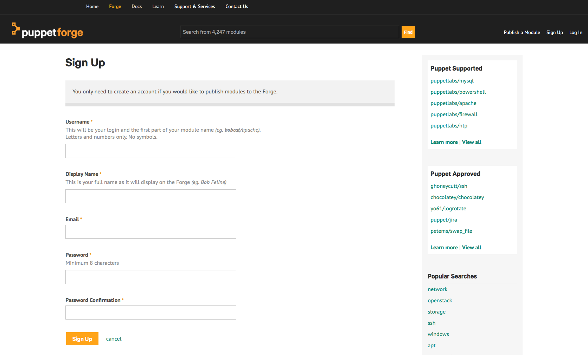

!SLIDE small
# Publishing Modules

1. Create a Puppet Forge account, if you don’t already have one
 * Sign up at http://forge.puppet.com 

2. Prepare your module
 * Correct directory layout
 * Remove unwanted files and symlinks 

3. Write a `metadata.json` file with the required metadata
 * Required keys: `name`, `version`, `author`, `license`, `summary`, `source`, `dependencies`, `project_page`, `operatingsystem_support` and `tags`

4. Build an uploadable tarball of your module

    <pre>
    # puppet module build {MODULE DIRECTORY}
    </pre>

5. Upload your module using the Puppet Forge’s web interface

!SLIDE noprint
# Puppet Forge Sign Up

!SLIDE printonly
# Puppet Forge Sign Up

