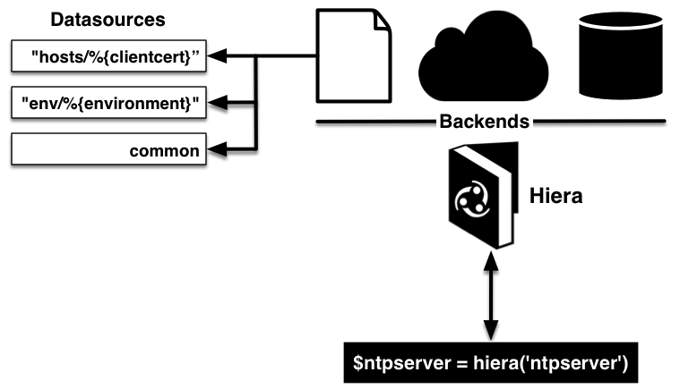

!SLIDE smbullets
# Parameter Lookup

* Separation of configuration and data
* Automatic Lookup of parameters was introduced in Puppet 3
* Facts and other variables in scope are used to determine a hierarchy
* Improvements in Puppet 4 are not declared as stable for now
* Default is
 * Hiera, a hierarchical lookup
 * One global configuration

~~~SECTION:handouts~~~

****

Puppet 3 added an automatic lookup of parameters to allow the separation
of configuration and data. The tool used for this is Hiera, a hierarchical
lookup. With Puppet 4 it was improved to add three layers of lookup, the
classic global hiera, environment data and module data, but this feature
is not declared stable for now and perhaps will have some more changes.
Environment data and module data have to be enabled while the global one
is active pre default and pre configured.

~~~ENDSECTION~~~

!SLIDE smbullets
# Hierarchical Lookup

* Hierarchy of lookups is configurable:
 * Hierarchy level can be fix or use variables
 * Global configuration uses Hiera 3
 * Environment and module configuration uses Hiera 4
* Different backends are available:
 * YAML/JSON - default
 * EYAML - YAML with encrypted fields
 * MySQL/PostgreSQL - Database lookup
 * and more 

!SLIDE small
# Sample Configuration

    # cat /etc/puppet/environments/production/hiera.yaml
    ---
    version: 4
    datadir: data
    hierarchy:
      - name: "Nodes"
        backend: yaml
        path: "nodes/%{trusted.certname}"

      - name: "Exported JSON nodes"
        backend: json
        paths:
            - "nodes/%{trusted.certname}"
            - "insecure_nodes/%{facts.fqdn}"

      - name: "virtual/%{facts.virtual}"
        backend: yaml    

      - name: "common"
        backend: yaml

~~~SECTION:handouts~~~

****

Hiera 3 uses a different configuration format and has less capabilities but
is still the default. Hiera 4 is used for the optional environment data and
module data. The hierachy levels can be a fix string or use variables from Puppet.

The automatic lookup uses the namespace to find a variable, for example parameter 
manage_service of module apache has to be apache::manage_service for the automatic lookup.

Hiera can utilize different backends which are pluggable. Per default it only
provides a file based configuration in YAML or JSON format. Other common formats
are eYAML which adds encrypted fields to default YAML or Database lookups. Furthermore
specific solutions like Foreman are available which use an existing datastore as backend.

~~~ENDSECTION~~~

!SLIDE noprint
# Resolution Hierarchy

!SLIDE printonly
# Resolution Hierarchy

