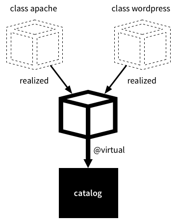

!SLIDE smbullets
# Virtual Resources

* Specifies a desired state for a resource without necessarily enforcing that state
* Manage the resource by realizing it elsewhere in your manifests
* Virtual resources can only be declared once
* Can be realized any number of times

!SLIDE noprint
# Virtual Resources

!SLIDE printonly
# Virtual Resources

!SLIDE small
# Virtual Resources Syntax

Mark resources as virtual:

    @@@ Puppet
    @package { 'gcc':
      ensure => present
    }

Realize virtual resources:

    @@@ Puppet
    realize Package['gcc']

No duplicate definitions:

    @@@ Puppet
    realize Package['gcc']
    realize Package['gcc']
    realize Package['gcc']
