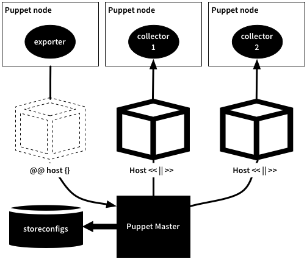

!SLIDE smbullets
# Exported Resources

* Export resources to a database (PuppetDB)
* Collect and use them on other nodes

!SLIDE
# Exported Resources

!SLIDE smbullets small
# Exported Resources Syntax

Declare exported resources:

    @@@ Puppet
    @@sshkey { $hostname:
      type => dsa,
      key  => $sshdsakey,
    }

Collect exported resources:

    @@@ Puppet
    Sshkey <<| |>>

!SLIDE smbullets
# Lab ~~~SECTION:MAJOR~~~.~~~SECTION:MINOR~~~: Use Exported Resources

* Objective:
 * Create a haproxy configuration using exported resources
* Steps:
 * Install `puppetlabs-haproxy` module
 * Expand the `apache` module
 * Declare an exported resource `haproxy::balancermember` in `config.pp`
 * Install `haproxy` and collect exported resources
 * Test and apply your configuration

!SLIDE supplemental exercises
# Lab ~~~SECTION:MAJOR~~~.~~~SECTION:MINOR~~~: Use Exported Resources

## Objective:

****

* Create a haproxy configuration using exported resources

## Steps:

****

* Install `puppetlabs-haproxy` module
* Expand the `apache` module
* Declare an exported resource `haproxy::balancermember` in `config.pp`
* Install `haproxy` and collect exported resources 
* Test and apply your configuration

!SLIDE supplemental solutions
# Lab ~~~SECTION:MAJOR~~~.~~~SECTION:MINOR~~~: Proposed Solution

****

## Use Exported Resources

****

    @@@ Sh
    # puppet module install puppetlabs-haproxy
    # vim /etc/puppet/modules/apache/manifests/config.pp
    class apache::config (
    ) inherits apache::params {
      $vhosts = $apache::vhosts

      file { $apache_config:
        ensure => file,
        owner  => 'root',
        group  => 'root',
        source => 'puppet:///modules/apache/httpd.conf',
      }

      @@haproxy::balancermember { 'master':
        listening_service => "${apache_service}",
        server_names      => "$::fqdn",
        ipaddresses       => "$::ipaddress",
        ports             => '80',
        options           => 'check',
      }

      $vhosts.each | String $name, Hash $vhost | {
        apache::vhost { $name :
          * => $vhost,
        }
      }
    }

    # puppet parser validate /etc/puppet/modules/apache/config.pp
    # vim /etc/puppet/modules/apache/examples/haproxy.pp
    include apache
    include haproxy
    Haproxy::Balancermember <<| |>>

    # puppet parser validate /etc/puppet/modules/apache/examples/haproxy.pp
    # puppet apply --noop /etc/puppet/modules/apache/examples/haproxy.pp
    # puppet apply /etc/puppet/modules/apache/examples/haproxy.pp
