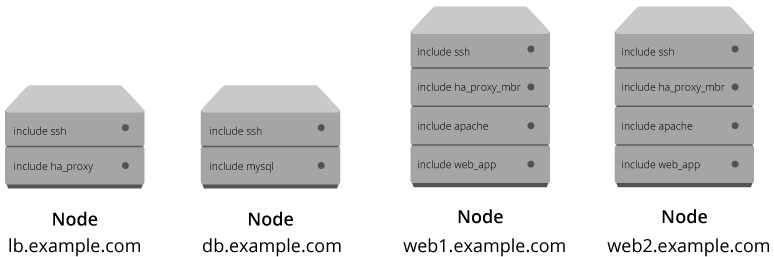
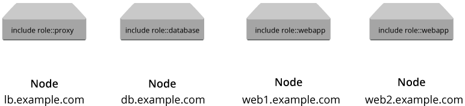

!SLIDE small 
# Roles

    @@@ Puppet
    class role::webapp {
      include profile::base
      include profile::customapp
      include profile::test_tools
    }

* Defines a set of technology stacks (profiles) that make up a logical role
* Includes as many profiles as required to define itself
* Abstracts the business role from the implementation details
* Contains no logic at all
* Roles only implement profiles

!SLIDE smbullets noprint
# Mapping Nodes to Roles

**A node can only have one role!**

* If a node requires two roles, it has by definition become a new role
* A single role can be applied to many nodes, however

!SLIDE smbullets printonly
# Mapping Nodes to Roles

**A node can only have one role!**

* If a node requires two roles, it has by definition become a new role
* A single role can be applied to many nodes, however

!SLIDE smbullets noprint
# Mapping Nodes to Roles

**A node can only have one role!**

* If a node requires two roles, it has by definition become a new role
* A single role can be applied to many nodes, however

!SLIDE smbullets printonly
# Mapping Nodes to Roles

**A node can only have one role!**

* If a node requires two roles, it has by definition become a new role
* A single role can be applied to many nodes, however

!SLIDE small
# Classifying Nodes

Simply assign a role to each node

    @@@ Puppet
    node 'bob.training.vm' {
      include role::database_control_panel
    }

* Roles define the logical role a node should play
 * Select profiles that make up a logical role
 * Expose no implementation details

!SLIDE smbullets 
# Lab ~~~SECTION:MAJOR~~~.~~~SECTION:MINOR~~~: Designing Roles

* Objective:
 * Designing Roles
* Steps:
 * Step 1
 * Step 2

!SLIDE supplemental exercises
# Lab ~~~SECTION:MAJOR~~~.~~~SECTION:MINOR~~~: Designing Roles

## Objective:

****

* Designing Roles

## Steps:

****

* Step 1
* Step 2

!SLIDE supplemental solutions
# Lab ~~~SECTION:MAJOR~~~.~~~SECTION:MINOR~~~: Proposed Solution

****

## Designing Roles

****

Some solution:

    @@@ Sh
    # ...
