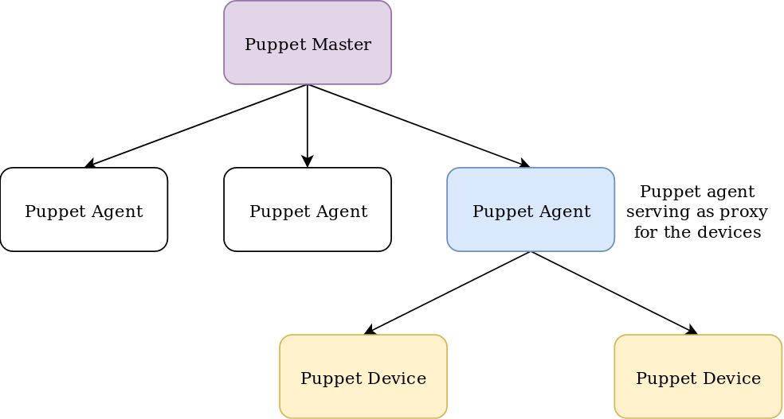

!SLIDE subsection
# ~~~SECTION:MAJOR~~~ Device

!SLIDE noprint
# Puppet Device

In a typical deployment model, a Puppet agent is installed on each system managed by Puppet. However, not all systems can have agents installed on them.

For these devices, you can configure a Puppet agent on another system which connects to the API or CLI of the device, and acts as a proxy between the device and the Puppet master.

Puppet device runs as a single process in the foreground that manages devices, rather than as a daemon or service like a Puppet agent.

Its recommended to use the `puppetlabs/device_manager`: https://forge.puppet.com/puppetlabs/device_manager

Additonally there might be other modules necessary, specific to the devices e.g. `puppetlabs/cisco_ios` or `puppetlabs/f5`

!SLIDE noprint
# Puppet Device

