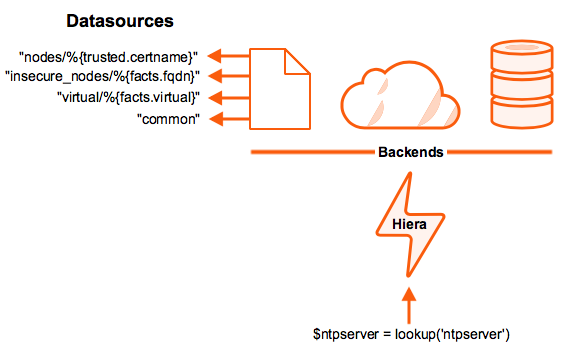

!SLIDE smbullets
# Parameter Lookup

* Separation of configuration and data
* Automatic Lookup of parameters was introduced in Puppet 3
* Facts and other variables in scope are used to determine a hierarchy
* Improvements in Puppet 4.9
* Default is
 * Hiera, a hierachical lookup
 * One global configuration

~~~SECTION:handouts~~~

****

Puppet 3 added an automatic lookup of parameters to allow the separation
of configuration and data. The tool used for this is Hiera, a hierarchical
lookup. With Puppet 4 it was improved to add three layers of lookup, the
classic global hiera, environment data and module data.

~~~ENDSECTION~~~

!SLIDE smbullets
# Hierarchical Lookup

* Hierarchy of lookups is configurable
 * Hierarchy level can be fix or use variables
 * Hiera 4 was never released as stable, replaced in Puppet 4.9
 * Environment and module configuration uses Hiera 5
* Different backends are avaiable
 * YAML/JSON - default
 * EYAML - YAML with encrypted fields
 * MySQL/PostgreSQL - Database lookup
 * LDAP and more

Caution: Hiera (version 5) means configuration version 5 and not the version of the hiera binary.

!SLIDE small
# Sample Configuration

    @@@Sh
    $ cat /etc/puppetlabs/puppet/hiera.yaml
    ---
    version: 5
    defaults:
      datadir: data
      data_hash: yaml_data
    hierarchy:
      - name: "Per-node data (yaml version)"
        path: "%{::hostname}.yaml"
      - name: "Other YAML hierarchy levels"
        paths:
          - "%{::domain}.yaml"
          - "defaults.yaml"

~~~SECTION:handouts~~~

****

Hiera 3 uses a different configuration format, has less capabilities and is
deprecated since Pupept 4.9. Hiera now is complete integrated in Puppet. Hiera 3
was a seperated project. The hierachy levels can be a fix string or use variables
from Puppet. With version 5 the file suffix i.e. .yaml is required.

All features and the complete syntax is described in the online documentation:
https://docs.puppet.com/puppet/4.9/hiera_config_yaml_5.html

Note: The old hiera_* functions are deprecated now and should be relaced with the
lookup function.

Hiera can utilize different backends which are plugable. Per default it only
provides a file based configuration in YAML or JSON format. Other common formats
are eYAML which adds encrypted fields to default YAML or Database lookups. Furthermore
specific solutions like Foreman are available which use an existing datastore as backend.

~~~ENDSECTION~~~

!SLIDE noprint
# Resolution Hierarchy

!SLIDE printonly
# Resolution Hierarchy

