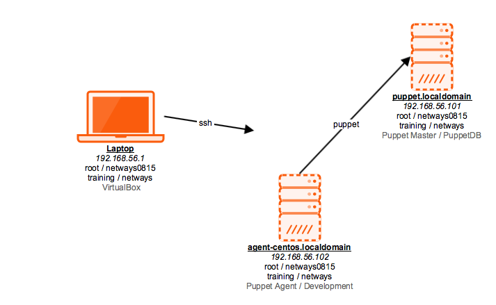

!SLIDE noprint
# Training Environment

!SLIDE printonly
# Training Environment

~~~SECTION:handouts~~~

****

The laptop provided for the training is running CentOS 7 with Gnome 3 in Fallback mode.
You can login with the unprivileged user "training" and password "netways". 
The password for user "root" typically not required is "netways0815".

For virtualization the laptop runs Virtualbox. The virtual machines are best accessed using ssh
with the user "training" and password "netways". The user "root" has the same password.

The virtual machine named "puppet.localdomain" has the Puppet Master and a Git repository
pre-installed which will be required for later labs.

On "agent-centos.localdomain" we will install Puppet as an agent and will use it for developing
our puppet code, it has a clone of the Git repository allowing us to commit code and publish it
onto the master, located in the home directory of the "training" user.

~~~ENDSECTION~~~

