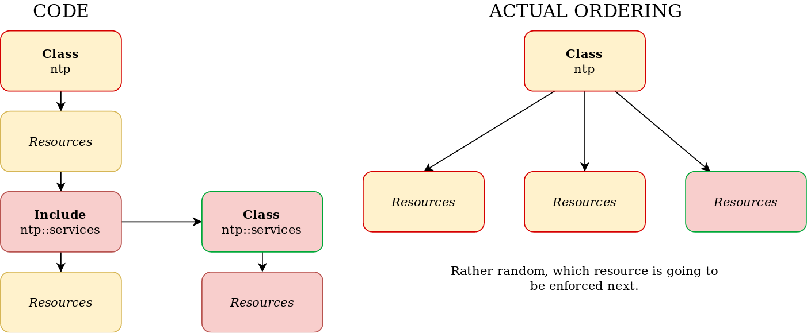
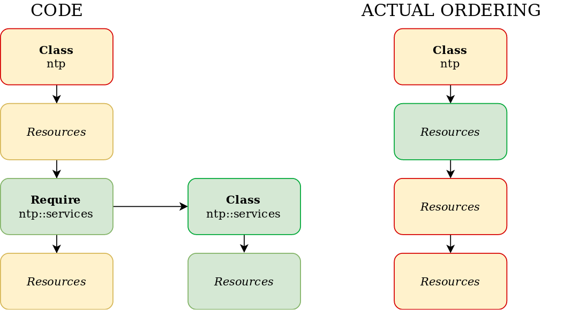
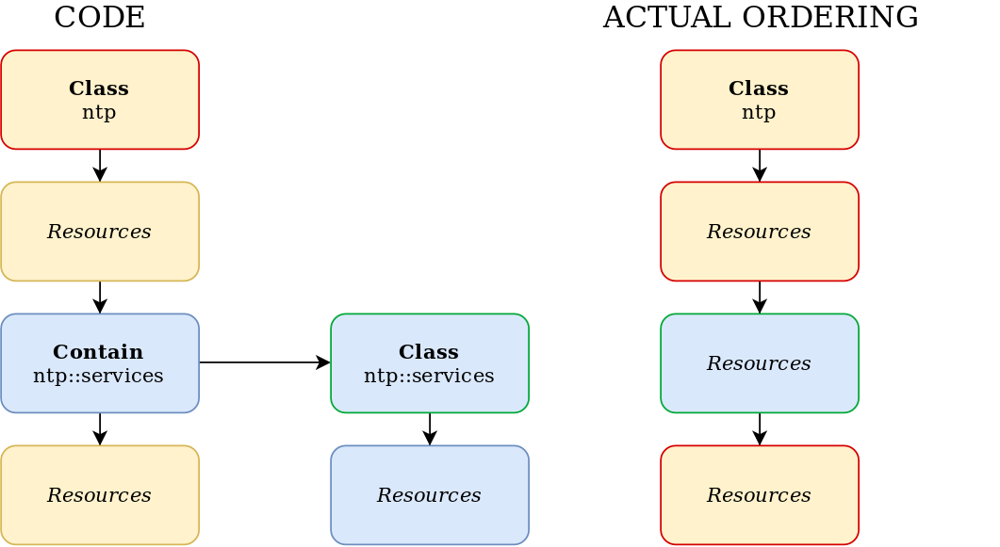

!SLIDE small
# include Function

    @@@Puppet
    class wordpress {
      include apache
      include mysql
      ...
    }

* Enforcement order can be unpredictable and surprising
* Classes included in other classes are unordered

!SLIDE noprint
# include Function

!SLIDE small
# require Function

    @@@Puppet
    class wordpress {
      require apache
      require mysql
      ...
    }

* Declares a class and causes it to become a dependency of the surrounding container
* Every resource in the `apache` and `mysql` classes to be applied before any of the resources in the `wordpress` class

!SLIDE noprint
# require Function

!SLIDE small
# Class Ordering

    @@@Puppet
    class repositories {
      include host::secure

      yumrepo { 'custom':
        ...
      }
    }

    class apache {
      include host::secure
      include apache::install
      include apache::config
      include apache::service 
    }

    Class['repositories'] -> Class['apache']

* Resources are contained inside the classes they are declared in
* All resources in `Class['repositories']` are enforced before all resources in `Class['apache']`

!SLIDE small
# contain Function

    @@@Puppet
    class ntp {
      file { '/etc/ntp.conf':
        ...
      }

      contain ntp::service
      ...
    }

* Puppet OSS 3.4.0+ or Puppet Enterprise 3.2.0+
* Declare the class with include-like behavior if it isn’t already declared
* Contained by the surrounding class
* Replacement for `anchor` resource

!SLIDE noprint
# contain Function

!SLIDE small
# anchor Resource

    @@@Puppet
    class container {

      anchor { 'container:begin':
        before => Class['ssh', 'fail2ban', 'nagios'],
      }

      include ssh
      include fail2ban
      include nagios

      anchor { 'container:end':
        require => Class['ssh', 'fail2ban', 'nagios'],
      }
    }

* Compatibility with Puppet OSS < 3.4.0 or Puppet Enterprise < 3.2.0
* Resources are contained
* Relationships can be established between resources and classes

!SLIDE smbullets
# Declaring Classes

* **include**
 * Ensure that the named class is included
 * Sets no ordering relationships

* **require**
 * Ensure that the named class is included
 * Also ensure that the named class is enforced before the current one

* **contain**
 * Ensure that the named class is included
 * Also ensure that the named class is contained in the current one
 * Automates the anchor pattern
 * Available in Puppet OSS 3.4+ or Puppet Enterprise 3.2+
