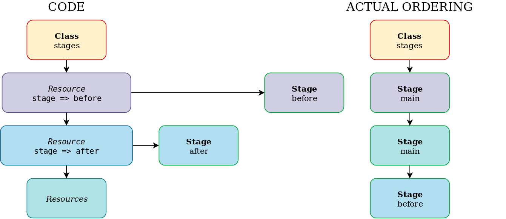

!SLIDE small
# Run Stages

* Allow for specific ordering of a class during runtime
* Are declared as resources
* Use existing relationship syntax
* There is always an implied stage called `main`
* Stage `main` is the default stage for all classes
* Only entire classes can be put in a run stage

!SLIDE small
# Declare Stages

Metaparameters:

    @@@Puppet
    class stages {
      stage { 'before':
        before => Stage['main'],
      }

      stage { 'after':
        require => Stage['main'],
      }
    }

Chaining arrows:

    @@@Puppet
    class stages {
      stage { [ 'before', 'after']: }

      Stage['before'] -> Stage['main'] -> Stage['after']
    }

!SLIDE noprint
# Declare Stages

!SLIDE small
# Assign Classes to Stages

    @@@Puppet
    class webserver {
      include stages
      include packages # Gets Stage['main'] by default

      class { 'yum':
        stage => 'before',
      }

      class { 'apache':
        stage => 'after',
      }
    }

!SLIDE smbullets
# Lab ~~~SECTION:MAJOR~~~.~~~SECTION:MINOR~~~: Use Stages

* Objective:
 * Run `yum` stage before `main` stage
* Steps:
 * Create a new subclass `apache::yumrepos`
 * Add a `yumrepo` resource for `CentOS Base`
 * Define subclass `apache::yumrepo` as `yum` stage
 * Make sure `yum` stage is executed before `main` stage
 * Test and apply your configuration

!SLIDE supplemental exercises
# Lab ~~~SECTION:MAJOR~~~.~~~SECTION:MINOR~~~: Use Stages

## Objective:

****

* Run `yum` stage before `main` stage

## Steps:

****

* Create a new subclass `apache::yumrepos`
* Add a `yumrepo` resource for `CentOS Base`
* Define subclass `apache::yumrepo` as `yum` stage
* Make sure `yum` stage is executed before `main` stage
* Test and apply your configuration

!SLIDE supplemental solutions
# Lab ~~~SECTION:MAJOR~~~.~~~SECTION:MINOR~~~: Proposed Solution

****

## Use Stages 

****

    @@@Puppet
    training@agent $ cd /home/training/puppet/modules/apache
    training@agent $ pdk new class yumrepos
    training@agent $ vim manifests/yumrepos.pp
    class apache::yumrepos {
      yumrepo { 'base':
        ensure     => 'present',
        descr      => 'CentOS-$releasever - Base',
        gpgcheck   => '1',
        gpgkey     => 'file:///home/training/pki/rpm-gpg/RPM-GPG-KEY-CentOS-7',
        mirrorlist => 'http://mirrorlist.centos.org/?release=$releasever&arch=$basearch&repo=os&infra=$infra',
      }
    }

    training@agent $ puppet parser validate manifests/yumrepos.pp
    training@agent $ pdk new class stages
    training@agent $ vim manifests/stages.pp
    class apache::stages {
      stage { 'yum':
        before => Stage['main'],
      }
    }

    training@agent $ puppet parser validate manifests/stages.pp
    training@agent $ vim manifests/init.pp
    ...
    include apache::stages
 
    class { 'apache::yumrepos':
      stage => 'yum',
    }

    training@agent $ puppet parser validate manifests/init.pp
    training@agent $ sudo puppet apply --noop examples/init.pp
    training@agent $ sudo puppet apply examples/init.pp
