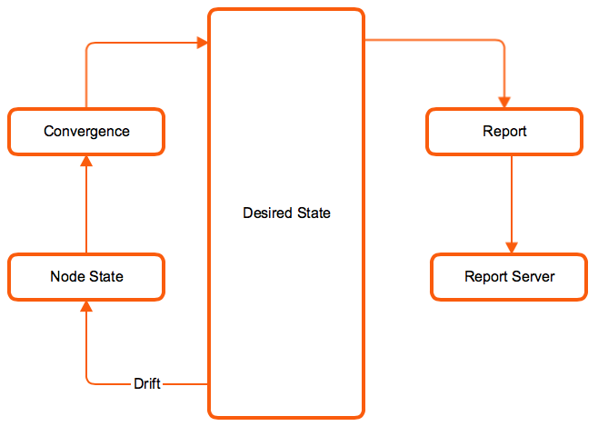

!SLIDE noprint
# Agent Reports

The Puppet Agent can send a report to the Puppet Master after every puppet run

!SLIDE printonly
# Agent Reports

The Puppet Agent can send a report to the Puppet Master after every puppet run

!SLIDE small
# What's in a Report?

Basic Example:

    info: Applying configuration version '1328975856'
    Notice: /Stage[main]/Main/File[/tmp/foo]/mode: 
       mode changed '0444' to '0644'
    notice: Finished catalog run in 0.03 seconds

* Metadata about the node, its environment and Puppet version, and the catalog used in the run
* The status of every resource
* Actions that Puppet took during the run, also called events
* Log messages that were generated during the run
* Metrics about the run, such as its duration and how many resources were in a given state
