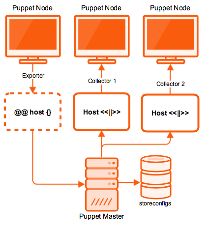

!SLIDE smbullets
# Exported Resources

* Export resources to a database (PuppetDB)
* Collect and use them on other nodes

!SLIDE
# Exported Resources

!SLIDE smbullets small
# Exported Resources Syntax

Declare exported resources:

    @@@Puppet
    @@sshkey { $hostname:
      type => dsa,
      key  => $sshdsakey,
    }

Collect exported resources:

    @@@Puppet
    Sshkey <<| |>>

!SLIDE smbullets
# Lab ~~~SECTION:MAJOR~~~.~~~SECTION:MINOR~~~: Use Exported Resources

* Objective:
 * Create a host entry configuration using exported resources
* Steps:
 * Insert a host collector into the top scope of your site.pp
 * And add an exported host entry to the node definition of `agent-centos.localdomain`
 * Push your configuration to `production`
 * Do an agent run on `agent-centos.localdomain`
 * Now a puppet run on your master will apply the same entry to `puppet.localdomain`

!SLIDE supplemental exercises
# Lab ~~~SECTION:MAJOR~~~.~~~SECTION:MINOR~~~: Use Exported Resources

## Objective:

****

* Create a host entry configuration using exported resources

## Steps:

****

* Insert a host collector into the top scope of your site.pp
* And add an exported host entry to the node definition of `agent-centos.localdomain`
* Push your configuration to `production`
* Do an agent run on `agent-centos.localdomain`
* Now a puppet run on your master will apply the same entry to `puppet.localdomain`

!SLIDE supplemental solutions
# Lab ~~~SECTION:MAJOR~~~.~~~SECTION:MINOR~~~: Proposed Solution

****

## Use Exported Resources

****

Insert a collector into the top scope of your site.pp:

    @@@Sh
    training@puppet $ cd /home/training/puppet
    training@puppet $ vim manifests/site.pp
    Host <<||>>

And add an exported host entry to the node definition of `agent-centos.localdomain`:

    @@@Sh
    training@puppet $ vim manifests/site.pp
    ...
    node 'agent-centos.localdomain' {
      @@host { 'kermit.localdomain':
        ensure => present,
        ip     => '127.0.0.2',
        host_aliases => 'kermit',
      }
      ...
    }

    training@puppet $ puppet parser validate manifests/site.pp
    training@puppet $ git add manifests/site.pp

Push your configuration to `production`:

    @@@Sh
    $ git commit -m 'host entires as exported resources'
    $ git push origin production

An agent run on `agent-centos.localdomain` store the host resource into the puppetdb and after that the entry is read and applied:

    @@@Sh
    $ sudo puppet agent -t
    Info: Using configured environment 'production'
    ...
    Notice: /Stage[main]/Main/Node[default]/Host[kermit.localdomain]/ensure: created
    Info: Computing checksum on file /etc/hosts
    Notice: Applied catalog in 0.10 seconds

The host resource is already stored and now a puppet run on your master will apply it to `puppet.localdomain`, too:

    @@@Sh
    $ sudo agent -t
    Info: Using configured environment 'production'
    ...
    Notice: /Stage[main]/Main/Node[default]/Host[kermit.localdomain]/ensure: created
    Info: Computing checksum on file /etc/hosts
    Notice: Applied catalog in 2.05 seconds
