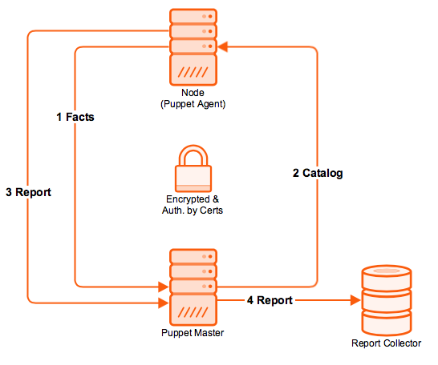

!SLIDE noprint
# Puppet Run Cycle

!SLIDE printonly
# Puppet Run Cycle

~~~SECTION:handouts~~~

****

~~~PAGEBREAK~~~

1. **Facts:** The node sends data about its state to the puppet master server.
2. **Catalog:** Puppet uses the facts to compile a Catalog that specifies how the node should be configured.
3. **Report:** Configuration changes are reported back to the Puppet Master.
4. **Report:** Puppet's open API can also send data to 3rd party tools.

~~~ENDSECTION~~~
