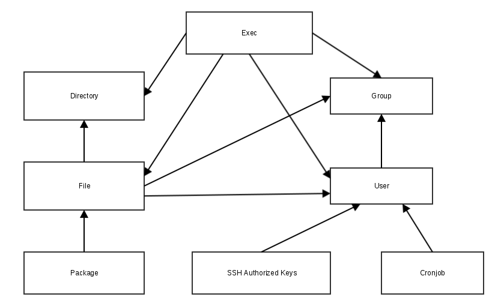
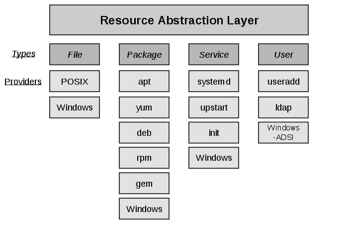

!SLIDE smbullets small
# Resources

    @@@ Puppet
    package { 'httpd':
      ensure => installed,
    }

    file { '/etc/httpd/conf/httpd.conf':
      ensure => file,
      owner  => 'root',
      group  => 'root',
      source => 'puppet:///modules/apache/httpd.conf',
    }

    service { 'httpd':
      ensure => running,
      enable => true,
    }

* Resources are building blocks
* They can be combined to make larger components
* Together they can model the expected state of your system

!SLIDE smbullets small
# Resource Defaults

Global defaults

    @@@ Puppet
    File {
      owner => 'root',
      mode  => '0644',
    }

Block based defaults (new with Puppet 4)

    @@@ Puppet
    file {
      default:
        mode   => '0600',
        owner  => 'root',
        group  => 'root',
        ensure => file,
      ;
      '/etc/ssh_host_key':
      ;
      '/etc/ssh_host_dsa_key.pub':
        mode => '0644',
      ;
    }

!SLIDE smbullets small
# Resource Relationships

    @@@ Puppet
    package { 'httpd':
      ensure => installed,
    }

    file { '/etc/httpd/conf/httpd.conf':
      ensure  => file,
      owner   => 'root',
      group   => 'root',
      source  => 'puppet:///modules/apache/httpd.conf',
      require => Package['httpd'],
    }

    service { 'httpd':
      ensure    => running,
      enable    => true,
      subscribe => File['/etc/httpd/conf/httpd.conf'],
    }

* Puppet does enforce resources top down
* Four metaparameters to define relationships (before, subscribe, require and notify)

~~~SECTION:handouts~~~

****

~~~PAGEBREAK~~~

One major change from older versions is Puppet 4 does enforce resources top down. In older versions enforcement order was based on
the hash of the resource type and title, so now it is more predictable. But you should not only rely on the written order because
implicit and explicit dependencies will change the order. So it is best practice to define relationships and to enforce code developers
to explicitly define relationships you can tell puppet to enforce resources in random order if no dependencies is given.

~~~ENDSECTION~~~

!SLIDE smbullets small noprint
# Implicit Dependencies

!SLIDE smbullets small printonly
# Implicit Dependencies

~~~SECTION:handouts~~~

****

The picture above shows an overview of the most important implicit dependencies.
A dependency is only created if both resources are managed by Puppet.

To find all implicit dependencies have a look on the Autorequires description of
the resources on: https://docs.puppet.com/puppet/latest/reference/type.html

~~~ENDSECTION~~~

!SLIDE noprint
# Resource Abstraction Layer

!SLIDE printonly
# Resource Abstraction Layer

~~~SECTION:handouts~~~

****

The picture above gives some examples of the Resource Abstraction Layer used by Puppet.

The Resource Abstraction Layer defines types like Package with all attributes required to describe them
and offers Providers to realize them depending on the commands available on the plattform the resource
is assigned to.

~~~ENDSECTION~~~

!SLIDE smbullets small
# Puppet Resource Command

    @@@ Puppet
    $ puppet resource package vim-enhanced
    package { 'vim-enhanced':
      ensure => 'purged',
    }

    $ sudo puppet resource package vim-enhanced ensure=present
    Notice: /Package[vim-enhanced]/ensure: created
    package { 'vim-enhanced':
      ensure => '7.4.160-1.el7',
    }

* Puppet provides a command to directly interact with the Resource Abstraction Layer
* Querying all or one resource of a type returns Puppet code representation of current state
* Setting attributes will change state using available provider
