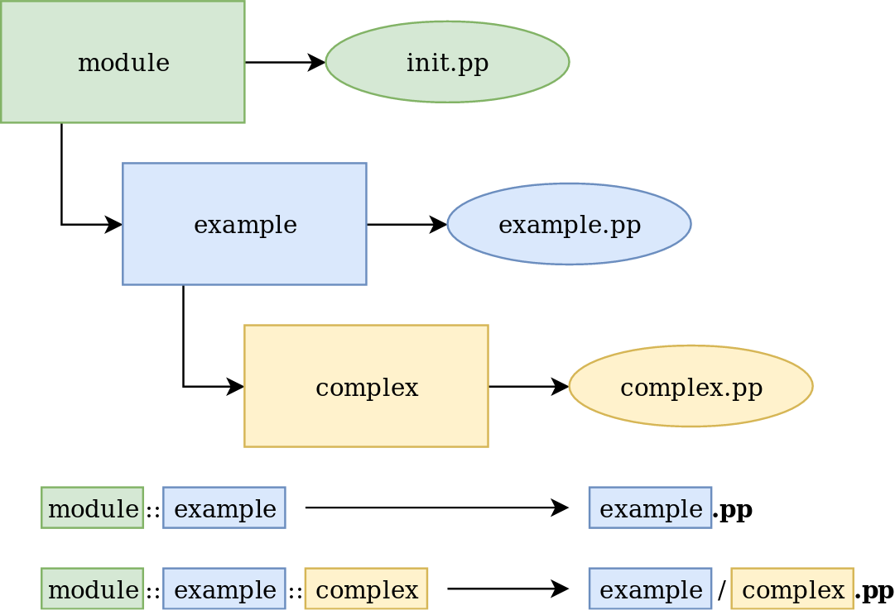

!SLIDE small
# Module Layout

     @@@Puppet
     {MODULE NAME}
     |-- examples       <- Smoke tests
     |-- facts.d        <- External facts
     |-- files          <- Static files
     |-- lib            <- Plugins
     |   |-- facter     <- Custom facts
     |   `-- puppet     <- Custom functions, types and providers
     |-- manifests      <- Puppet classes
     |   `-- init.pp    <- Main manifest file
     |-- metadata.json  <- Module description
     |-- README.md      <- Readme file
     |-- spec           <- Unit tests
     `-- templates      <- Dynamic files in ERB or EPP syntax

~~~SECTION:handouts~~~

****

On disk, a module is simply a directory tree with a specific, predictable structure.

~~~ENDSECTION~~~

!SLIDE smbullets small
# Autoloading

Classes in `manifests`

* Default class (main manifest) named like the module found in `init.pp`
* Classes in files matching there names
 * `module::example` in `example.pp`
 * `module::example::complex` in `example/complex.pp`

Files in `files`

* Served by Puppet fileserver as 'puppet:///modules/{MODULE NAME}/{FILE NAME}'

Templates in `templates`

* Lookup by Puppet template functions like
 * Embedded Ruby (ERB): 'template({MODULE NAME}/{TEMPLATE NAME}.erb)'
 * Embedded Puppet (EPP): 'epp({MODULE NAME}/{TEMPLATE NAME}.epp)'

!SLIDE small noprint
# Autoloading

!SLIDE small printonly
# Autoloading

