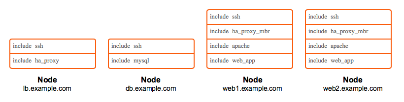

!SLIDE smbullets 
# Evolving Infrastructure

* Infrastructure grows
* More and more edge cases
* Wanna reuse code
* Eventually code feels bulky and high maintenance

!SLIDE smbullets noprint
# Modular Design

* Develop modules and
* Classify them to nodes

!SLIDE smbullets printonly
# Modular Design

* Develop modules and
* Classify them to nodes

!SLIDE smbullets
# Danger Signs

* Resources declared in multiple modules
* You find yourself wondering where your implementation fits
* Copious amount of logic at a node level
* Repetition and duplication
* The `if` statement is your best friend
