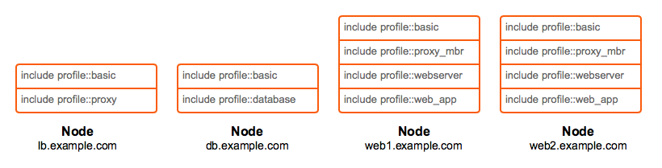

!SLIDE small
# Profiles

    @@@Puppet
    class profile::myapp {
      include tomcat
      include mysql

      class { '::myapp':
        db_engine => 'mysql',
        db_host   => 'localhost',
      }
    }

* Break everything down into components
* Think about what things actually are instead of just what they look like
* Look for overlap and similarities in application stacks
* Reduce each application into granular Puppet modules
* Create a code layer responsible for implementation

!SLIDE smbullets noprint
# Mapping Nodes to Profiles

* Modules are grouped to profiles

!SLIDE smbullets printonly
# Mapping Nodes to Profiles

* Modules are grouped to profiles

!SLIDE smbullets 
# Lab ~~~SECTION:MAJOR~~~.~~~SECTION:MINOR~~~: Designing Profiles

* Objective:
 * Create `database` and `webserver` profiles on `agent-centos.localdomain`
* Steps:
 * Install `puppetlabs-mysql` module
 * Create a `database` profile for mysql
 * Create a `webserver` profile for apache
 * Test and apply your configuration

!SLIDE supplemental exercises
# Lab ~~~SECTION:MAJOR~~~.~~~SECTION:MINOR~~~: Designing Profiles

## Objective:

****

* Create `database` and `webserver` profiles on `agent-centos.localdomain`

## Steps:

****

* Install `puppetlabs-mysql` module
* Create a `database` profile for mysql
* Create a `webserver` profile for apache
* Test and apply your configuration

!SLIDE supplemental solutions
# Lab ~~~SECTION:MAJOR~~~.~~~SECTION:MINOR~~~: Proposed Solution

****

## Designing Profiles

****

Create `database` and `webserver` profiles on `agent-centos.localdomain`:

    @@@Sh
    training@agent $ puppet module install puppetlabs-mysql

    training@agent $ mkdir /home/training/puppet/modules/profiles/{examples,manifests}
    training@agent $ cd /home/training/puppet/modules

Create a `database` profile for mysql:

    @@@Sh
    training@agent $ vim profiles/manifests/database.pp
    class profiles::database {
      class { '::mysql::server':
        root_password           => 'swordfish',
        remove_default_accounts => true,
      }

      mysql_database { 'information_schema':
        ensure  => present,
        charset => 'utf8',
        collate => 'utf8_general_ci',
      }

      mysql_database { 'mysql':
        ensure  => present,
        charset => 'latin1',
        collate => 'latin1_swedish_ci',
      }

      mysql_database { 'performance_schema':
        ensure  => present,
       charset => 'utf8',
       collate => 'utf8_general_ci',
      }
    }

    training@agent $ puppet parser validate profiles/manifests/database.pp
    training@agent $ vim profiles/examples/database.pp
    include profiles::database

    training@agent $ puppet parser validate profiles/examples/database.pp
    training@agent $ sudo puppet apply --noop profiles/examples/database.pp
    training@agent $ sudo puppet apply profiles/examples/database.pp

Create a `webserver` profile for apache:

    @@@Sh
    training@agent $ vim profiles/manifests/webserver.pp
    class profiles::webserver {
      class { 'apache':
        ensure => running,
        enable => true,
        ssl    => true,
      }
    }

    training@agent $ puppet parser validate profiles/manifests/webserver.pp
    training@agent $ vim profiles/examples/webserver.pp
    include profiles::webserver

    training@agent $ puppet parser validate profiles/examples/webserver.pp

Test and apply your configuration:

    @@@Sh
    training@agent $ sudo puppet apply --noop profiles/examples/webserver.pp
    training@agent $ sudo puppet apply profiles/examples/webserver.pp
