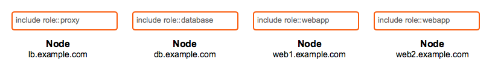

!SLIDE smbullets small 
# Roles

    @@@Puppet
    class role::webapp {
      include profile::base
      include profile::customapp
      include profile::test_tools
    }

* Defines a set of technology stacks (profiles) that make up a logical role
* Includes as many profiles as required to define itself
* Abstracts the business role from the implementation details
* Contains no logic at all
* Roles only implement profiles

!SLIDE smbullets noprint
# Mapping Nodes to Roles

**A node can only have one role!**

* If a node requires two roles, it has by definition become a new role
* A single role can be applied to many nodes, however

!SLIDE smbullets printonly
# Mapping Nodes to Roles

**A node can only have one role!**

* If a node requires two roles, it has by definition become a new role
* A single role can be applied to many nodes, however

!SLIDE smbullets 
# Lab ~~~SECTION:MAJOR~~~.~~~SECTION:MINOR~~~: Designing Roles

* Objective:
 * Create and use a `webserver` role on `agent-centos.localdomain`
* Steps:
 * Combine `database` and `webserver` profiles to a role
 * Test and apply your configuration

!SLIDE supplemental exercises
# Lab ~~~SECTION:MAJOR~~~.~~~SECTION:MINOR~~~: Designing Roles

## Objective:

****

* Create and use a `webserver` role on `agent-centos.localdomain`

## Steps:

****

* Combine `database` and `webserver` profiles to a role
* Test and apply your configuration

!SLIDE supplemental solutions
# Lab ~~~SECTION:MAJOR~~~.~~~SECTION:MINOR~~~: Proposed Solution

****

## Designing Roles

****

Create and use a `webserver` role on `agent-centos.localdomain`:

    @@@Sh
    $ mkdir /home/training/puppet/modules/roles/{examples,manifests}
    $ cd /home/training/puppet/modules

Combine `database` and `webserver` profiles to a role:

    @@@Sh
    $ vim roles/manifests/webserver.pp
    class roles::webserver {
      include profiles::database
      include profiles::webserver
    }

    $ puppet parser validate roles/manifests/webserver.pp
    $ vim roles/examples/webserver.pp
    include roles::webserver

    $ puppet parser validate roles/examples/webserver.pp

Test and apply your configuration:

    @@@Sh
    $ sudo puppet apply --noop roles/examples/webserver.pp
    $ sudo puppet apply roles/examples/webserver.pp
