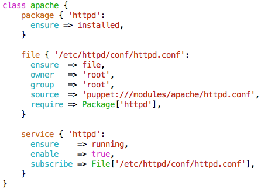

!SLIDE smbullets
# Syntax Highlighting

* Easier to read and edit
* Faster troubleshooting
* Available for most editors

!SLIDE
# Syntax Checking

Manually with: **puppet parser validate {FILE NAME}.pp**

    @@@Sh
    $ puppet parser validate apache/manifests/init.pp
    Error: Could not parse for environment production: \
      Syntax error at end of file; expected '}' at \
      /home/training/puppet/modules/apache/manifests/init.pp:17

**Note:** `Syntastic` (https://github.com/scrooloose/syntastic) is a syntax checking plugin for Vim that runs files through external syntax checkers and displays any resulting errors to the user. This can be done on demand, or automatically as files are saved. Syntastic provides also check plugins for Puppet.

~~~SECTION:handouts~~~

****

Syntastic is available from: https://github.com/scrooloose/syntastic

~~~ENDSECTION~~~
