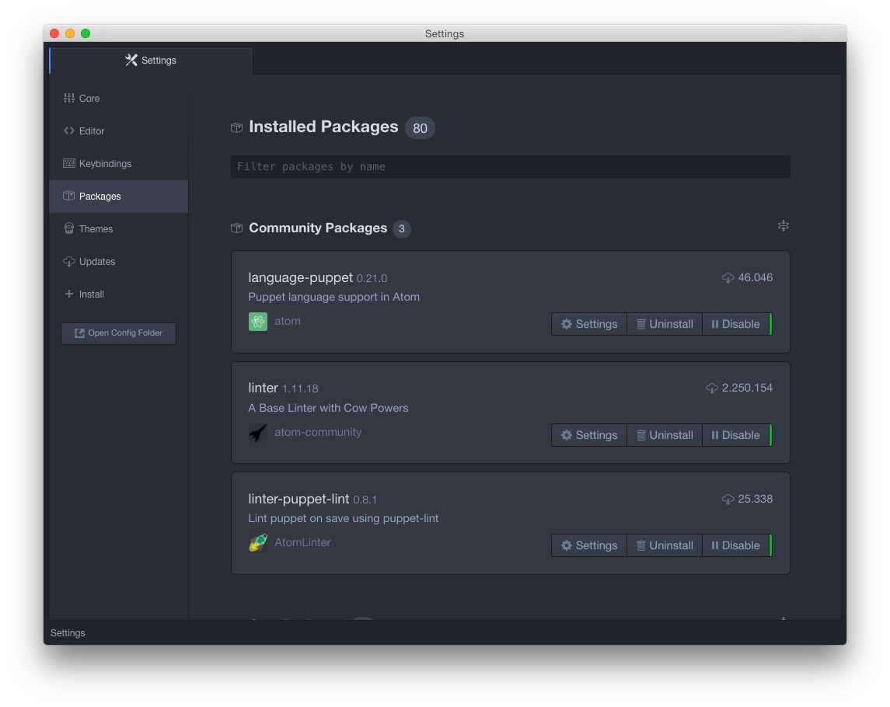
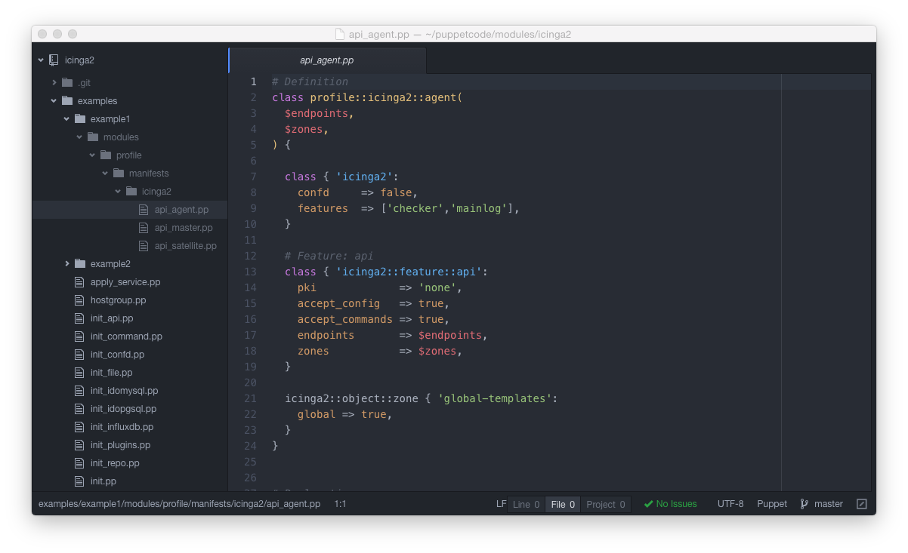

!SLIDE smbullets noprint
# Atom (1/2)

* Easy to install and easy to use editor, extendable via packages

* Make sure you install necessary dependencies

!SLIDE smbullets printonly
# Atom (1/2)

* Easy to install and easy to use editor, extendable via packages

* Make sure you install necessary dependencies

!SLIDE smbullets noprint
# Atom (2/2)

* language-puppet: auto ident and syntax highlighting
* linter-puppet-lint: on the fly puppet-lint

!SLIDE smbullets print only
# Atom (2/2)

* language-puppet: auto ident and syntax highlighting
* linter-puppet-lint: on the fly puppet-lint

Atom is available on: https://atom.io
